# GFA-ECO (RecoveryOS) — Entity-Relationship Diagram

**Source:** Live Postgres catalog of Supabase project `cqcxvwoukyhxyokfwnjm`, schema `recoveryos` (plus one deprecated table in `public`), extracted 2026-09-17. Evidence class: **B — Verified Operational Evidence** (read directly from the running database, not from design documents).

**Scope:** 85 tables in `recoveryos`, all primary keys and all foreign keys. Diagrams are grouped by functional area so each one stays readable; every foreign key in the schema appears in exactly one diagram below. Hub tables (`people`, `organizations`, `residences`, …) are drawn in full once and referenced as bare boxes elsewhere.

**Conventions**
- `PK` / `FK` mark primary and foreign key columns.
- Relationship lines carry the FK column name as the label.
- Cardinality encodes FK nullability: `||--o{` = child row **must** have a parent (NOT NULL FK); `|o--o{` = optional parent (nullable FK); `||--o|` = one-to-zero-or-one.
- Column-level nullability is otherwise omitted for legibility; enum types (`service_modality`, `role_key`, …) are Postgres enums in schema `recoveryos`.

---

## 1. Identity & Access

`people` is the hub of the entire schema — nearly every other table references it (as participant, provider, coach, navigator, or as an audit actor such as `recorded_by_person_id` / `verified_by_person_id`). A person may be linked to a Supabase `auth.users` account.

```mermaid
erDiagram
    auth_users {
        uuid id PK
    }
    people {
        bigint id PK
        uuid auth_user_id FK
        text first_name
        text last_name
        text preferred_name
        text pronouns
        date date_of_birth
        timestamptz created_at
        timestamptz updated_at
    }
    person_profiles {
        bigint person_id PK
        text bio
        date recovery_date
        jsonb accessibility_preferences
        jsonb communication_preferences
        text timezone
        timestamptz updated_at
    }
    person_classification {
        bigint person_id PK
        text classification
        text reason
        timestamptz created_at
        timestamptz updated_at
    }
    contact_methods {
        bigint id PK
        bigint person_id FK
        text kind
        text value
        bool is_primary
        bool is_verified
        timestamptz created_at
    }
    emergency_contacts {
        bigint id PK
        bigint person_id FK
        text name
        text phone
        text relationship
        bool notify_authorized
        bool is_active
        timestamptz created_at
        timestamptz updated_at
    }
    role_assignments {
        bigint id PK
        bigint person_id FK
        role_key role_key
        bigint organization_id FK
        bigint program_id FK
        bigint residence_id FK
        bigint granted_by_person_id FK
        timestamptz granted_at
        timestamptz revoked_at
    }
    staff_preauthorizations {
        bigint id PK
        text email
        role_key_array role_keys
        text note
        timestamptz consumed_at
        bigint consumed_person_id FK
        timestamptz created_at
        text purpose
        bigint organization_id FK
        bigint residence_id FK
        timestamptz expires_at
        timestamptz revoked_at
        bigint created_by_person_id FK
    }
    support_team_memberships {
        bigint id PK
        bigint person_id FK
        bigint member_person_id FK
        text member_role
        date started_at
        date ended_at
    }
    provider_meeting_rooms {
        bigint id PK
        bigint person_id FK
        text provider
        text room_url
        bool is_active
        timestamptz created_at
        timestamptz updated_at
    }
    leads {
        bigint id PK
        text first_name
        text last_name
        text email
        text phone
        text message
        text interest
        text readiness
        text source
        text status
        bigint assigned_to_person_id FK
        bigint converted_person_id FK
        text notes
        timestamptz created_at
        timestamptz updated_at
    }

    auth_users |o--o{ people : "auth_user_id"
    people ||--o| person_profiles : "person_id"
    people ||--o| person_classification : "person_id"
    people ||--o{ contact_methods : "person_id"
    people ||--o{ emergency_contacts : "person_id"
    people ||--o{ role_assignments : "person_id"
    people |o--o{ role_assignments : "granted_by_person_id"
    organizations |o--o{ role_assignments : "organization_id"
    programs |o--o{ role_assignments : "program_id"
    residences |o--o{ role_assignments : "residence_id"
    people |o--o{ staff_preauthorizations : "created_by_person_id"
    people |o--o{ staff_preauthorizations : "consumed_person_id"
    organizations |o--o{ staff_preauthorizations : "organization_id"
    residences |o--o{ staff_preauthorizations : "residence_id"
    people ||--o{ support_team_memberships : "person_id"
    people ||--o{ support_team_memberships : "member_person_id"
    people ||--o{ provider_meeting_rooms : "person_id"
    people |o--o{ leads : "assigned_to_person_id"
    people |o--o{ leads : "converted_person_id"
```

## 2. Organizations & Programs

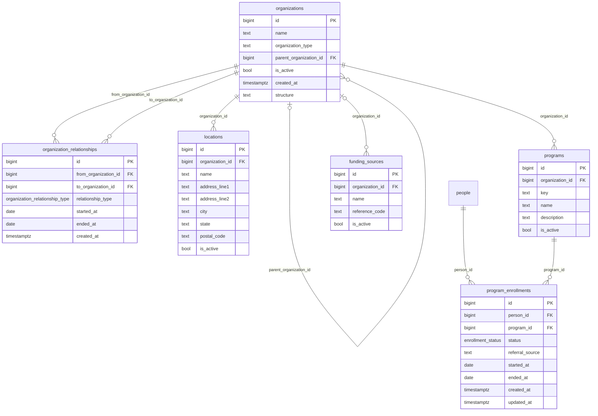

## 3. Housing — Structure & Occupancy

Physical hierarchy is `residences → residence_units → residence_rooms → residence_beds`. A `residency` is a person's stay at a residence; `bed_assignments` joins residencies to beds over time (note the deliberate circular pair: `bed_assignments.residency_id` and the denormalized pointer `residencies.bed_assignment_id` to the current assignment).

```mermaid
erDiagram
    residences {
        bigint id PK
        bigint organization_id FK
        bigint location_id FK
        text name
        text address_street
        text address_city
        text address_state
        text postal_code
        text phone
        text email
        int capacity
        bool is_active
        text population_served
        text narr_level
        text narr_certification_status
        text narr_affiliate
        numeric shared_room_fee_weekly
        numeric private_room_fee_weekly
        numeric shared_room_fee_monthly
        numeric private_room_fee_monthly
        bool accepts_mat
        bool accepts_supervision
        text public_description
        text level_of_support
        text_array commitments
        text curfew_weeknight
        bool is_public_directory
        timestamptz created_at
    }
    residence_units {
        bigint id PK
        bigint residence_id FK
        text name
    }
    residence_rooms {
        bigint id PK
        bigint unit_id FK
        text name
    }
    residence_beds {
        bigint id PK
        bigint room_id FK
        text name
        bool is_active
    }
    residencies {
        bigint id PK
        bigint person_id FK
        bigint residence_id FK
        bigint program_enrollment_id FK
        date admission_date
        date anticipated_exit_date
        date discharge_date
        residency_status residency_status
        bigint bed_assignment_id FK
        smallint phase
        date phase_started_at
        timestamptz created_at
        timestamptz updated_at
    }
    bed_assignments {
        bigint id PK
        bigint residency_id FK
        bigint bed_id FK
        timestamptz assigned_at
        timestamptz released_at
    }
    residency_phases {
        bigint id PK
        bigint residency_id FK
        int phase
        date started_on
        text note
        bigint recorded_by_person_id FK
        timestamptz created_at
    }

    organizations ||--o{ residences : "organization_id"
    locations |o--o{ residences : "location_id"
    residences ||--o{ residence_units : "residence_id"
    residence_units ||--o{ residence_rooms : "unit_id"
    residence_rooms ||--o{ residence_beds : "room_id"
    people ||--o{ residencies : "person_id"
    residences ||--o{ residencies : "residence_id"
    program_enrollments |o--o{ residencies : "program_enrollment_id"
    bed_assignments |o--o{ residencies : "bed_assignment_id"
    residencies ||--o{ bed_assignments : "residency_id"
    residence_beds ||--o{ bed_assignments : "bed_id"
    residencies ||--o{ residency_phases : "residency_id"
    people |o--o{ residency_phases : "recorded_by_person_id"
```

## 4. Housing — Applications, Referrals & Medication Review

`residence_application_intake` is the canonical public intake boundary (it superseded the deprecated `public.housing_applications`); an accepted intake converts into a `person` and a `residence_applications` row. `residence_listing_submissions` is the public pipeline for adding residences to the directory.

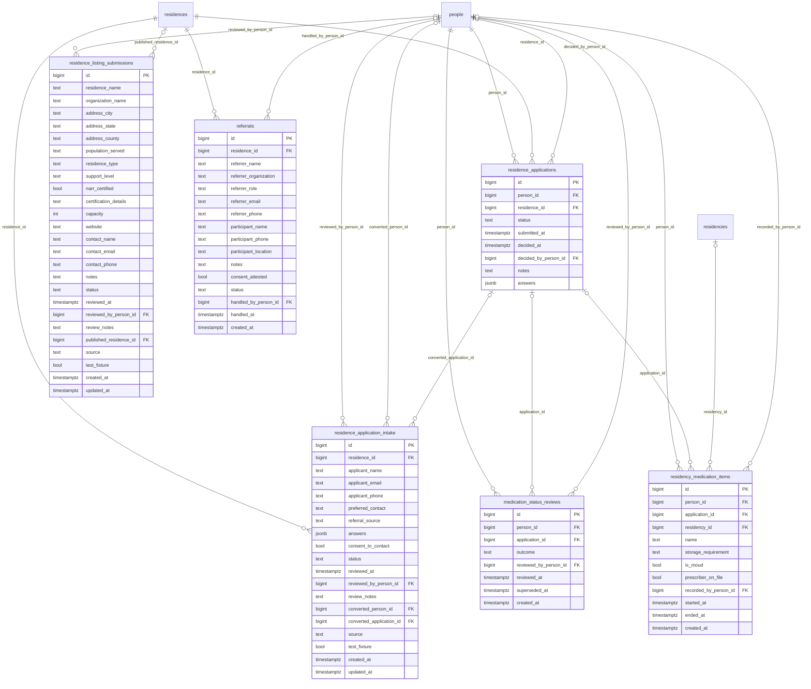

## 5. House Operations

Day-to-day life of a residence: curfews, passes, fees, screenings, chores, incidents, grievances, house posts, and house meetings.

```mermaid
erDiagram
    curfew_schedules {
        bigint id PK
        bigint residence_id FK
        int day_of_week
        time curfew_time
    }
    curfew_exceptions {
        bigint id PK
        bigint residency_id FK
        date exception_date
        timestamptz approved_until
        text reason
        bigint approved_by_person_id FK
        timestamptz created_at
    }
    employment_curfew_exceptions {
        bigint id PK
        bigint residency_id FK
        text employer_name
        text schedule_note
        bigint verified_by_person_id FK
        timestamptz verified_at
        bool active
        timestamptz created_at
    }
    passes {
        bigint id PK
        bigint residency_id FK
        timestamptz starts_at
        timestamptz ends_at
        text destination
        text status
        bigint decided_by_person_id FK
        timestamptz created_at
    }
    fee_ledger {
        bigint id PK
        bigint residency_id FK
        text entry_type
        numeric amount
        text method
        date period_start
        date period_end
        text receipt_number
        text note
        bigint recorded_by_person_id FK
        timestamptz created_at
    }
    screenings {
        bigint id PK
        bigint residency_id FK
        text screening_type
        timestamptz collected_at
        text result
        bigint recorded_by_person_id FK
    }
    residence_chores {
        bigint id PK
        bigint residence_id FK
        text name
        text description
        bool is_active
    }
    chore_assignments {
        bigint id PK
        bigint chore_id FK
        bigint residency_id FK
        date due_on
        timestamptz completed_at
        bigint verified_by_person_id FK
    }
    incidents {
        bigint id PK
        bigint residence_id FK
        bigint residency_id FK
        timestamptz occurred_at
        text category
        text summary
        int severity
        text follow_up
        bigint reported_by_person_id FK
        bigint reviewed_by_person_id FK
        timestamptz reviewed_at
        timestamptz created_at
    }
    grievances {
        bigint id PK
        bigint residence_id FK
        bigint filed_by_person_id FK
        text summary
        text status
        timestamptz filed_at
        timestamptz resolved_at
        bigint resolved_by_person_id FK
    }
    house_posts {
        bigint id PK
        bigint residence_id FK
        bigint author_person_id FK
        text category
        text title
        text body
        bool is_pinned
        timestamptz created_at
    }
    meetings {
        bigint id PK
        bigint organization_id FK
        bigint residence_id FK
        text title
        text description
        timestamptz starts_at
        timestamptz ends_at
        bool is_required_for_residents
        timestamptz created_at
    }
    meeting_attendance {
        bigint id PK
        bigint meeting_id FK
        bigint person_id FK
        text status
        bigint recorded_by_person_id FK
        timestamptz recorded_at
    }

    residences ||--o{ curfew_schedules : "residence_id"
    residencies ||--o{ curfew_exceptions : "residency_id"
    people |o--o{ curfew_exceptions : "approved_by_person_id"
    residencies ||--o{ employment_curfew_exceptions : "residency_id"
    people |o--o{ employment_curfew_exceptions : "verified_by_person_id"
    residencies ||--o{ passes : "residency_id"
    people |o--o{ passes : "decided_by_person_id"
    residencies ||--o{ fee_ledger : "residency_id"
    people |o--o{ fee_ledger : "recorded_by_person_id"
    residencies ||--o{ screenings : "residency_id"
    people |o--o{ screenings : "recorded_by_person_id"
    residences ||--o{ residence_chores : "residence_id"
    residence_chores ||--o{ chore_assignments : "chore_id"
    residencies ||--o{ chore_assignments : "residency_id"
    people |o--o{ chore_assignments : "verified_by_person_id"
    residences ||--o{ incidents : "residence_id"
    residencies |o--o{ incidents : "residency_id"
    people |o--o{ incidents : "reported_by_person_id"
    people |o--o{ incidents : "reviewed_by_person_id"
    residences ||--o{ grievances : "residence_id"
    people ||--o{ grievances : "filed_by_person_id"
    people |o--o{ grievances : "resolved_by_person_id"
    residences ||--o{ house_posts : "residence_id"
    people ||--o{ house_posts : "author_person_id"
    organizations ||--o{ meetings : "organization_id"
    residences |o--o{ meetings : "residence_id"
    meetings ||--o{ meeting_attendance : "meeting_id"
    people ||--o{ meeting_attendance : "person_id"
    people |o--o{ meeting_attendance : "recorded_by_person_id"
```

## 6. Compliance & Documents

NARR standards and the Iowa checklist track residence certification; document templates/versions/assignments handle policies, agreements, and signatures.

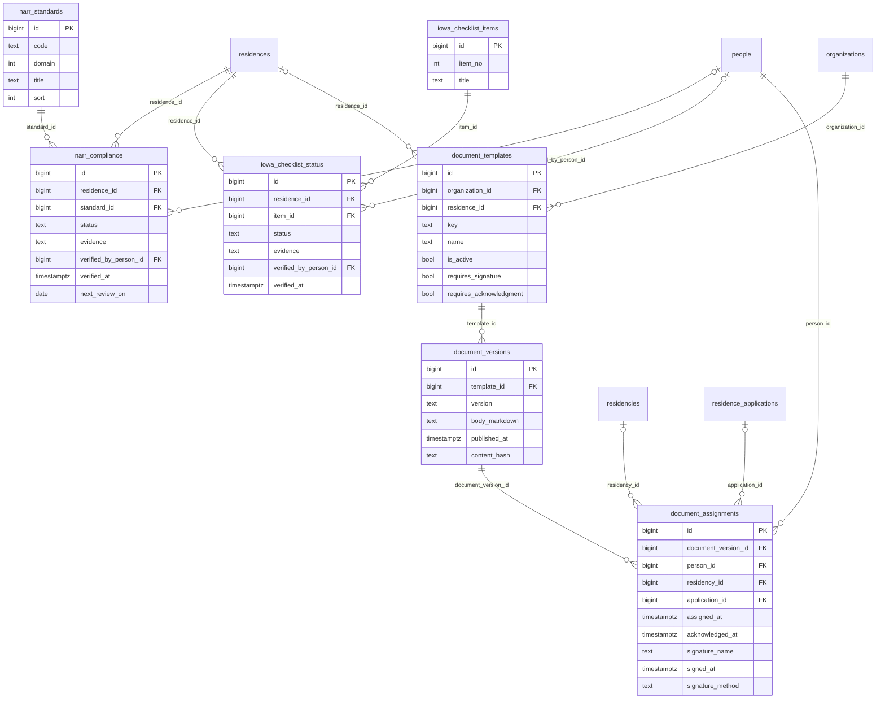

## 7. Coaching, Navigation & Community Resources

Coaching and navigation are separate relationship types. Navigation work flows Need → Referral → (connection evidence), preserving the doctrine that a referral is not automatically a connection. `domains` is the ratified canonical domain taxonomy; `resource_domains` is a multi-domain lens over community `resources`.

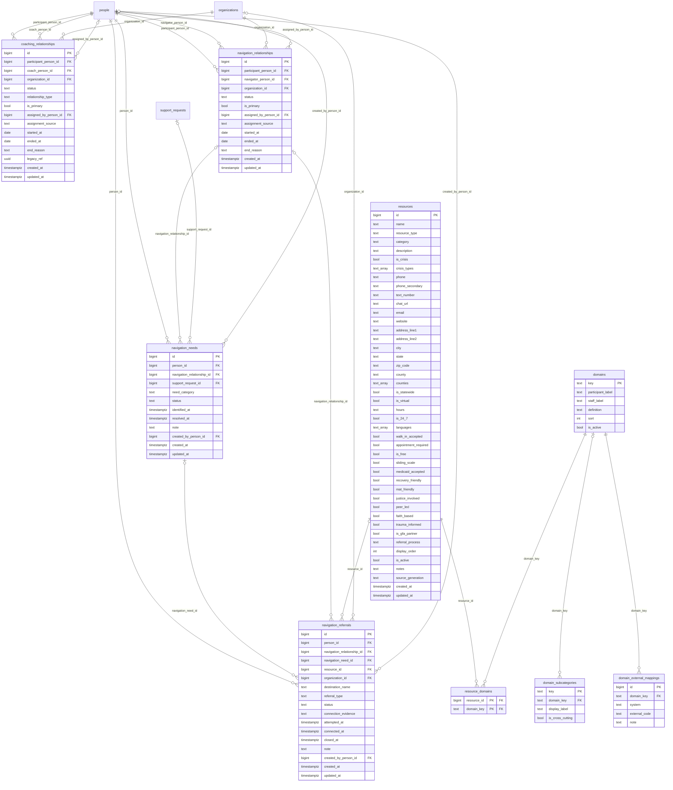

## 8. Support Requests, Booking & Service Delivery

The request-to-service flow: a `support_request` (an initiating state, never itself a delivered service) can lead to a `booking_request` with negotiated `booking_proposals`, which becomes an `appointment`, and delivered work is recorded as a `service_event` typed by the canonical `service_types` taxonomy. Note the intentional circular pairs between `appointments` and `booking_requests`/`service_events` (each side points at the other).

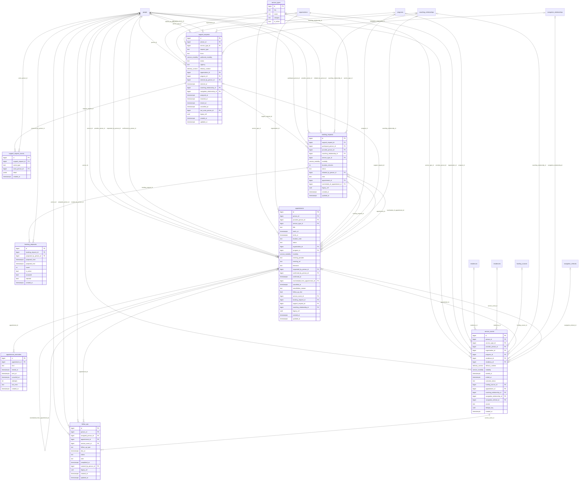

## 9. Recovery Plans & Wellbeing

Person-owned recovery planning (plan → goals → action steps, with goals optionally tied to a canonical domain), daily check-ins, and recovery capital assessments. `slogans` is a standalone content library referenced by check-ins by number, not by FK.

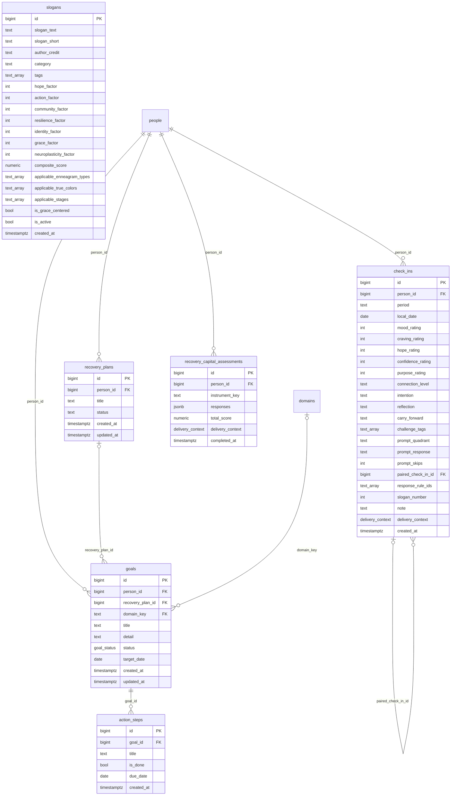

## 10. Consent & Supervision Coordination

Consent is first-class: typed, scoped, versioned, and revocable. Supervision coordination records (e.g., probation/parole contact) require an explicit consent grant.

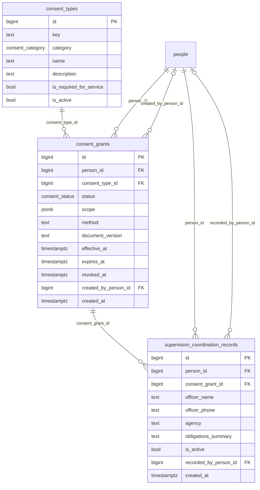

## 11. Messaging & Notifications

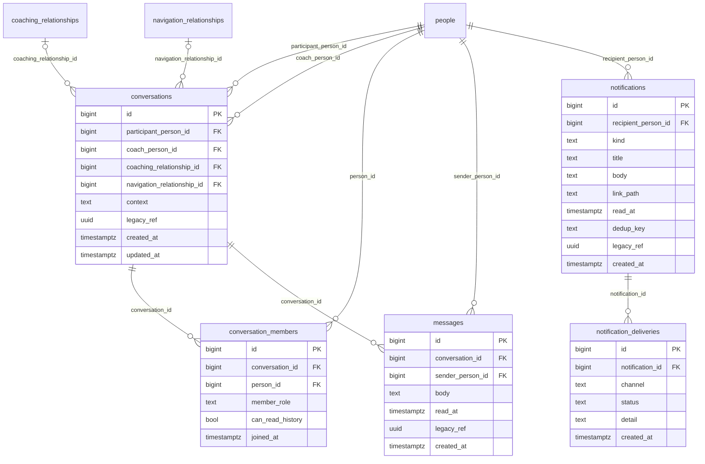

## 12. System & Operational Logs

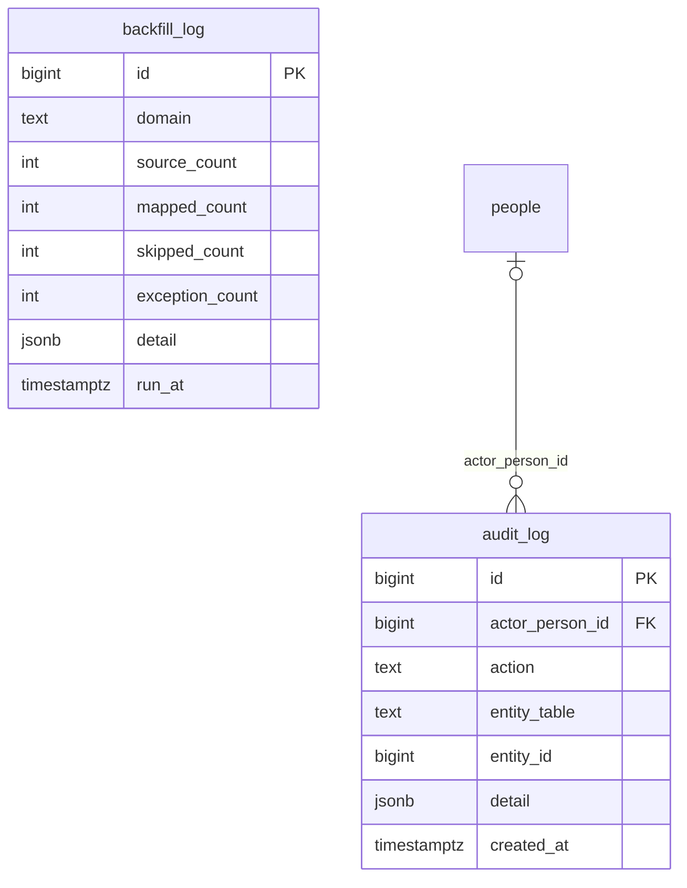

`audit_log.entity_table` / `entity_id` are a polymorphic reference to any table (no FK constraint by design).

## Deprecated: `public.housing_applications`

Superseded by `recoveryos.residence_application_intake` (Gate A containment, 2026-08-23). Retained as drift evidence and rollback material only — RLS enabled, no client privileges, no INSERT policy, 0 rows ever stored. No foreign keys. Columns: `id (uuid PK)`, `house_code`, `applicant_name`, `applicant_email`, `applicant_phone`, `county`, `personal (jsonb)`, `journey (jsonb)`, `your_why`, `consent_rules_reviewed`, `consent_share_with_house`, `consent_contact`, `status`, `source`, `submitted_at`, `intake_at`, `decided_at`, `decision_note`, `forms (jsonb)`, `signature (jsonb)`, `read_acknowledgments (jsonb)`, `created_at`, `updated_at`.

---

*Regeneration note: this document was generated from `pg_catalog` (tables, columns, primary keys, and foreign-key constraints of schema `recoveryos`). If the schema changes, regenerate from the live catalog rather than editing diagrams by hand.*
