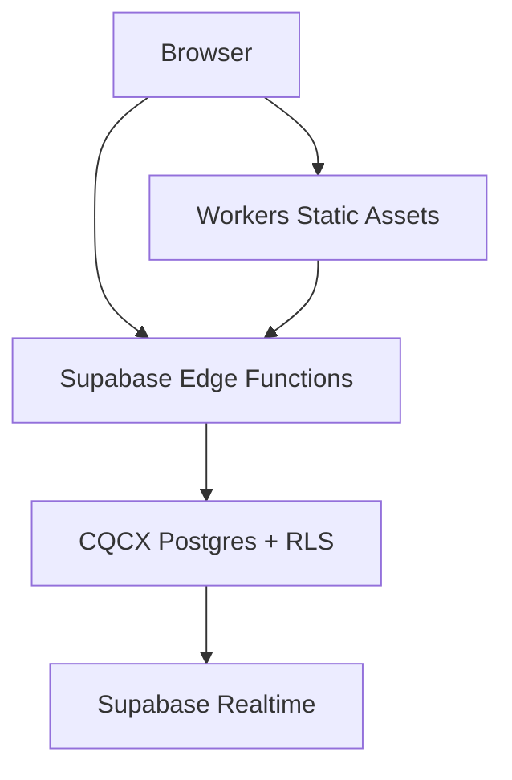

# Cloudflare–Supabase execution boundaries

Status: proposed consolidation baseline  
Date: 2026-09-07

## Decision

RecoveryOS uses the smallest runtime set that matches current requirements. The
Cloudflare product catalog is not mirrored as repository folders.

| Capability | Canonical owner | Repository location | Current status |
| --- | --- | --- | --- |
| Full-stack web UI and static assets | Cloudflare Workers Static Assets | `apps/platform`, root `wrangler*.jsonc` | Active |
| Database, identity, row authorization, files, realtime | Supabase CQCX | `supabase/migrations` | Active |
| Public and authenticated server logic | Supabase Edge Functions | `supabase/functions` | Active |
| Scheduled database work | Supabase Cron / pg_cron | SQL migrations | Active |
| Overlapping API gateway prototype | None | `workers/api` | Quarantined |
| Pages | None | — | Do not add |
| Durable Objects | None | — | Defer until per-key strongly coordinated state is proven |
| Cloudflare Workflows | None | — | Defer until a durable multi-step job is proven |
| Containers | None | — | Defer until a container-only workload is proven |
| Workers for Platforms | None | — | Not applicable without customer-supplied code |
| Cron Triggers | None | — | Prefer existing Supabase Cron for database-owned jobs |
| Snippets | None | — | Defer until zone-level HTTP mutation is required |
| Tail Workers | None | — | Consider only when Worker event processing is required |
| Smart Placement | None | — | Evaluate only after backend-distance latency is measured |

## Request paths

Cloudflare serves the application. Supabase owns business mutations and data
authorization. No second public-intake implementation may write directly to CQCX.

## Deployment boundary

Deployments are manual and immutable-ref driven. Staging requires
`DEPLOY_STAGING`; production-candidate requires `DEPLOY_CANDIDATE`. Neither
workflow performs DNS or custom-domain cutover. GitHub environment approvals and
Cloudflare account configuration remain external controls and must be verified.

## Promotion gates

1. CI passes for the exact commit.
2. Prepared migrations remain outside the ledger until separately authorized.
3. CQCX migration apply, Edge Function deploy, Cloudflare deploy, and DNS cutover are
   distinct approvals.
4. The retired Supabase project reference must be absent from deployable assets.
5. Public functions must reject missing/unapproved origins, enforce abuse controls,
   return non-sensitive errors, and avoid unapproved free-text exports.
